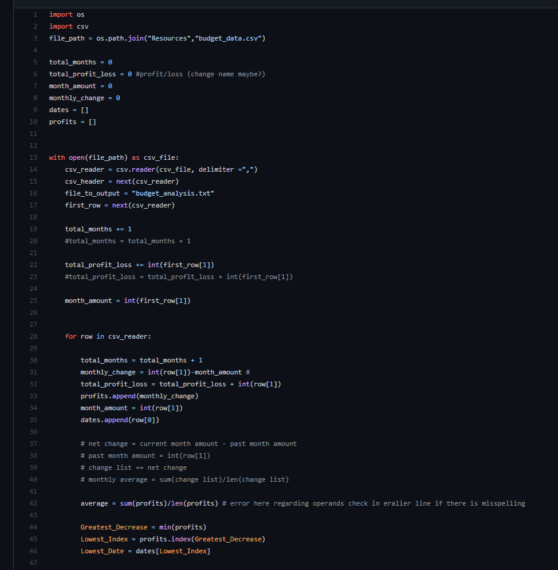

# Bank and Poll

Overview:

There are two files. PyBank And PyPoll

 

  

  

  

PyBank utilizes python to work with financial data to produce: 
      
     
     -The total number of months included in the dataset
     
     -The net total amount of "Profit/Losses" over the entire period

     -Calculate the changes in "Profit/Losses" over the entire period, then find the average of those changes

     -The greatest increase in profits (date and amount) over the entire period

     -The greatest decrease in profits (date and amount) over the entire period
     
   

 PyPoll utilizes python to work with election data to produce: 
 
     -The total number of votes cast

     -A complete list of candidates who received votes

     -The percentage of votes each candidate won

     -The total number of votes each candidate won

     -The winner of the election based on popular vote.

