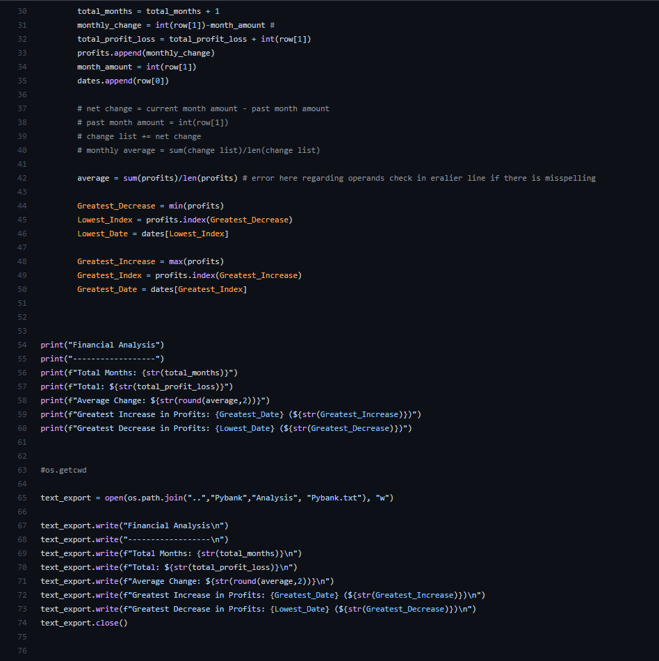
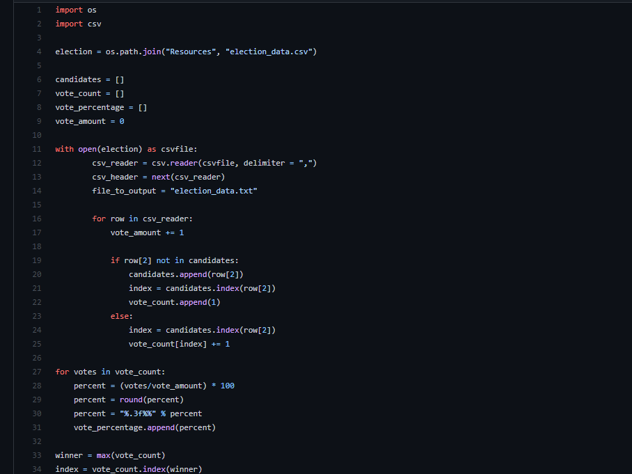

# Bank and Poll

Overview:

There are two files. PyBank And PyPoll

For pybank:

- After joining the paths and reading the csv we create empty brackets for:
      
      - Profit
      - Dates
  
- The other variables are set to equal 0
  
- Formulas are then applied to figure out average, montly change etc, 
- The code will then print out the result and create a .txt file with the results

 

  

- Similarly the code reads in a new csv and creates empty brackets for: 
      - Candidates 
      - Vote Count 
      - Vote Percentage
- While Vote Amount is equal to 0

- Afterwards we create a code to go through the csv and count each for vote fro each candidate 
- The code will then print out the result and create a .txt file with the results
  

  

PyBank utilizes python to work with financial data to produce: 
      
     
     -The total number of months included in the dataset
     
     -The net total amount of "Profit/Losses" over the entire period

     -Calculate the changes in "Profit/Losses" over the entire period, then find the average of those changes

     -The greatest increase in profits (date and amount) over the entire period

     -The greatest decrease in profits (date and amount) over the entire period
     
   

 PyPoll utilizes python to work with election data to produce: 
 
     -The total number of votes cast

     -A complete list of candidates who received votes

     -The percentage of votes each candidate won

     -The total number of votes each candidate won

     -The winner of the election based on popular vote.

